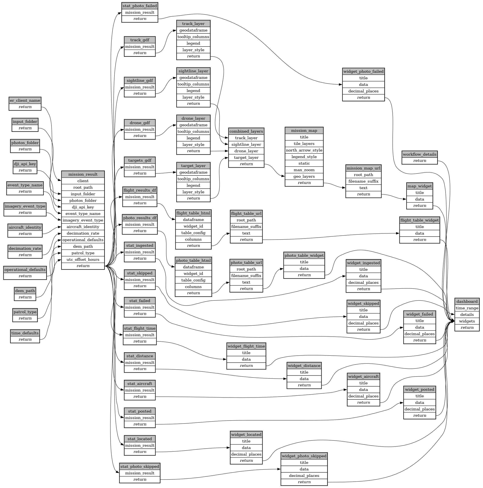

```
# AUTOGENERATED BY ECOSCOPE-WORKFLOWS; see fingerprint in README.md for details

```

```yaml
# fingerprint:
artifacts_sha256_basic: e0e55c496e47ce4de47c80f340c4e674470ed237ea21d0221a59616e1f0dc7f8
artifacts_sha256_strict: 87a905a81daf7be2f69c152870fb2295ab8c498a9faf9096d1ee9ea4bc7e15fb
installed_requirements:
- channel: https://repo.prefix.dev/ecoscope-workflows/
  name: ecoscope-platform
  version: {version: ==2.11.15}
params_sha256: 43340dd49528afc2ee518408cf4c111f75de96af5fb21cb39424d92f4642c409
spec_sha256: 5f4707ea8c1113f08417fe97de4abb63ce6ca191f8ccba636404563e0d518dad

```

# ecoscope-workflows-dji-er-workflow


